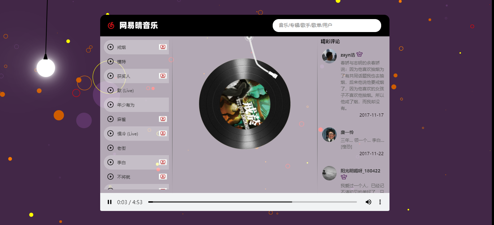
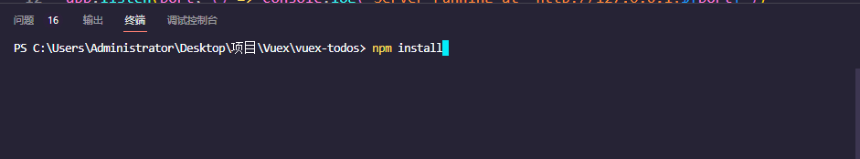
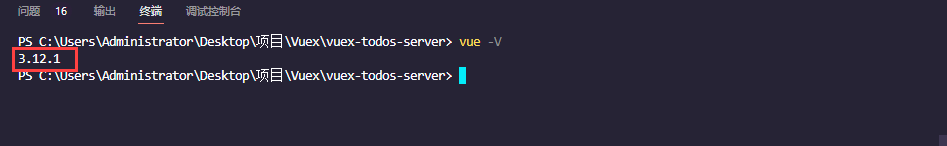

# vuex-music

## 简介

- 基于Vue2+Vuex+axios的在线网易晴音乐播放器

## 功能

- 播放歌曲、暂停歌曲
- 切换歌曲
- 调节音量
- 调节进度条
- 搜索歌曲
- 播放MV
- 显示精彩评论与个人信息
- 页面加载/刷新默认显示热歌榜前200与随机推荐歌曲
- *~~循环方式~~*
- *~~歌词显示~~*
- *~~音浪特效~~*

## API service

- 由[网易云音乐 Node.js API service](https://github.com/Binaryify/NeteaseCloudMusicApi)提供

## 演示

- https://vogadero.github.io/VuexMusic/

## Build

> - 首先安装vue-cli脚手架，直接在任意目录执行`npm install vue-cil@5 -g `对应版本为5系列
> - 然后使用`vue -V`查看版本

`clone`或`download`项目后, 直接在对应的目录执行`npm install`, 直接把前端服务所需要的依赖全部安装, 然后再执行对应的`npm run serve`即可启动前端服务

## Run

### 1. 将`vuex-music-server`解压

### 2. npm install安装依赖

### 3. 启动服务端  node app.js

> - 也可以自行在`vue ui`界面或者本地`vue-shop`路径下通过`npm run build`命令进行打包,将打包后的`dist`文件夹复制到`vue-music-server`文件夹中即可

### 4. 浏览器打开`app.js`配置地址http://127.0.0.1:68浏览项目
